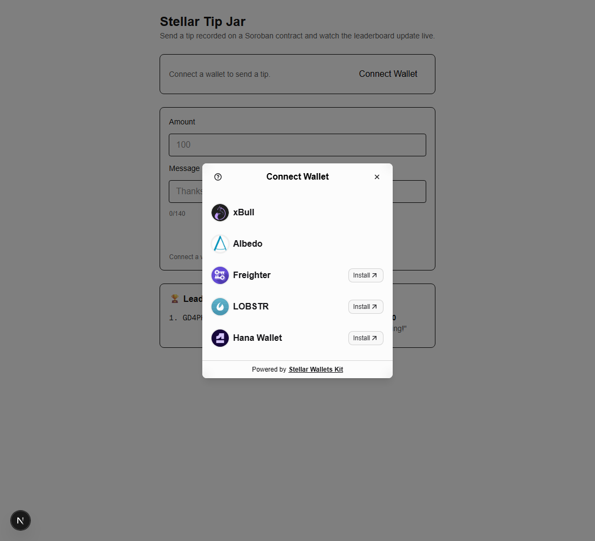
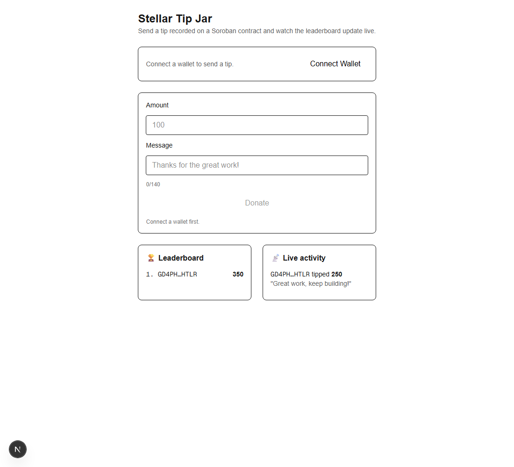

# Stellar Tip Jar 🎤

A **Stellar Testnet** dApp where anyone connects a wallet (via **StellarWalletsKit**),
sends a tip (amount + message) recorded on a deployed **Soroban smart contract**, and
watches a **live leaderboard** and **activity feed** update in real time from on-chain
events.

Built for the **Stellar Journey to Mastery — Yellow Belt** level: multi-wallet
integration, a deployed Soroban contract called from the frontend, contract reads/writes,
real-time event listening, and visible transaction status.

🔗 **Live demo:** https://stellar-tip-jar-seven.vercel.app

> **Network:** Stellar **Testnet** only. No real funds are involved.

---

## On-chain details

- **Deployed contract address:** `CALSKUBIYK5SMXU4WMQHRAMYRQLWUTVMF4FWIJC44SXTX5XCJPROQKTP`
  ([view on Stellar Expert](https://stellar.expert/explorer/testnet/contract/CALSKUBIYK5SMXU4WMQHRAMYRQLWUTVMF4FWIJC44SXTX5XCJPROQKTP))
- **Sample contract-call (`donate`) transaction:** `62400cf871ab1537a883dfcf6ca86bf14080c01e517e6ff643629956e701075c`
  ([verify on Stellar Expert](https://stellar.expert/explorer/testnet/tx/62400cf871ab1537a883dfcf6ca86bf14080c01e517e6ff643629956e701075c))

---

## How it works

The contract is an **on-chain donation ledger**. `donate(donor, amount, message)`
validates the input, accumulates each donor's running total, tracks distinct donors, and
**emits a `tip` event**. The frontend invokes `donate` through the connected wallet, then
a poller reads the contract's `tip` events via Soroban RPC `getEvents` every few seconds
to keep the leaderboard and activity feed in sync.

```
donate(amount, message) ──▶ Soroban contract ──▶ emits `tip` event
                                  ▲                      │
              get_leaderboard()  └──────────────────────┘  RPC getEvents poll (5s)
                                  ▼
                       live Leaderboard + Activity Feed
```

## Features

- 🔌 **Multi-wallet** connect / disconnect via [StellarWalletsKit](https://github.com/Creit-Tech/Stellar-Wallets-Kit) (Freighter, xBull, Albedo, LOBSTR, Hana)
- 📝 **Soroban contract** deployed to Testnet, written in Rust
- 💸 **`donate`** called from the frontend (contract write)
- 🏆 **Live leaderboard** from `get_leaderboard()` (contract read)
- 📡 **Activity feed** streaming `tip` events in real time
- 🔄 **Transaction status** — pending / success / fail, with a Stellar Expert link
- 🛡️ **Error handling** — wallet rejected, invalid/empty amount, empty/too-long message, RPC/tx failure
- 🔔 **Toast notifications** and a **Friendbot "Get Test XLM"** button

## Tech stack

- Rust + [`soroban-sdk`](https://docs.rs/soroban-sdk) + [`stellar-cli`](https://github.com/stellar/stellar-cli)
- [Next.js 16](https://nextjs.org) (App Router) + TypeScript + [Tailwind CSS v4](https://tailwindcss.com)
- [`@stellar/stellar-sdk`](https://github.com/stellar/js-stellar-sdk) (Soroban RPC + contract client)
- [`@creit.tech/stellar-wallets-kit`](https://github.com/Creit-Tech/Stellar-Wallets-Kit)
- [Zustand](https://github.com/pmndrs/zustand) · [sonner](https://sonner.emilkowal.ski/) · [Vitest](https://vitest.dev)

---

## Screenshots

| Wallet options (multi-wallet) | Live leaderboard + activity feed |
| --- | --- |
|  |  |

---

## Getting started

### Prerequisites

- [Node.js](https://nodejs.org) 20+
- A Stellar wallet extension (e.g. [Freighter](https://www.freighter.app/)) set to **Test Net**
- For contract work: Rust + the [`stellar-cli`](https://github.com/stellar/stellar-cli) (a GNU Rust toolchain avoids needing MSVC on Windows)

### Run the frontend

```bash
npm install
npm run dev
```

Open [http://localhost:3000](http://localhost:3000). The leaderboard and feed populate
from on-chain events automatically; connect a wallet to send your own tip.

### Build & deploy the contract (optional — already deployed)

```bash
cd contracts/tip-jar
stellar contract build
stellar contract deploy \
  --wasm target/wasm32v1-none/release/tip_jar.wasm \
  --source <your-funded-identity> \
  --network testnet
```

Then put the printed contract ID into `src/lib/config.ts` (`CONTRACT_ID`).

### Scripts

| Command | Description |
| --- | --- |
| `npm run dev` | Start the dev server |
| `npm run build` | Production build |
| `npm run lint` | Lint with ESLint |
| `npm test` | Unit tests (Vitest) for pure helpers |
| `cd contracts/tip-jar && cargo test --lib` | Contract unit tests |

---

## Project structure

```
contracts/tip-jar/        # Rust Soroban contract (donate + reads + tip event) + tests
src/
  app/                    # layout (Toaster) + page (wires everything)
  components/             # WalletBar, DonateForm, TxStatusBadge, Leaderboard, ActivityFeed, PollProvider
  lib/                    # wallet (StellarWalletsKit), contract (RPC client), events (getEvents poll),
                          # friendbot, format, config
  store.ts                # Zustand store
tests/                    # Vitest tests for pure helpers
```

## Network configuration

| Constant | Value |
| --- | --- |
| Network | `Test SDF Network ; September 2015` |
| Soroban RPC | `https://soroban-testnet.stellar.org` |
| Friendbot | `https://friendbot.stellar.org` |
| Explorer | `https://stellar.expert/explorer/testnet` |

## License

MIT
